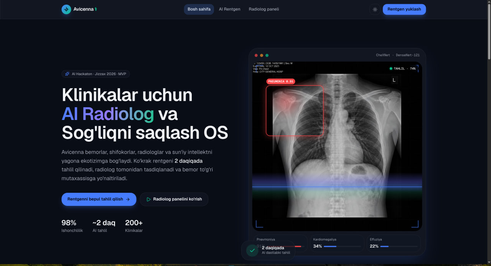
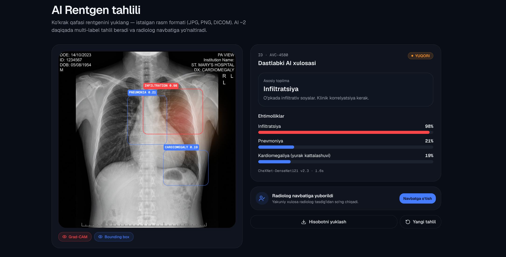
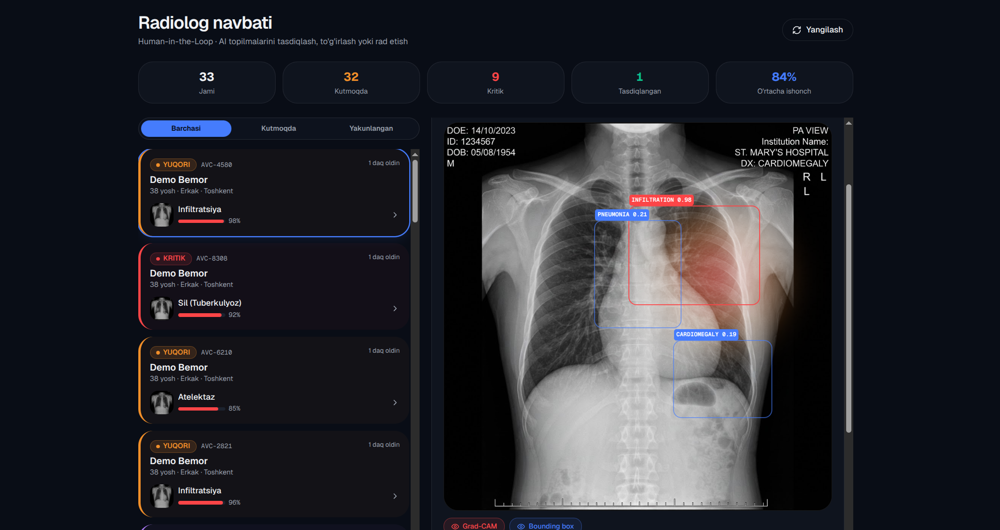
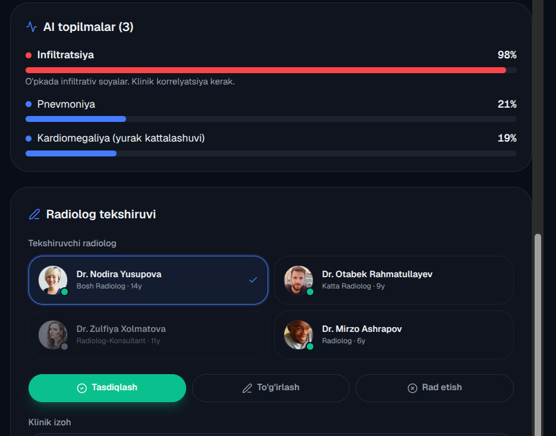

# Avicenna ⚕️ — AI Healthcare Operating System

> **The AI radiologist for clinics without radiologists.**
> Built for AI Hackathon · Jizzax 2026

---

## Screenshots

| Landing Page | AI X-Ray Analysis |
|---|---|
|  |  |

| Radiologist Queue | Doctor Referral Card |
|---|---|
|  |  |

---

## The Problem

In Uzbekistan's rural clinics, a chest X-ray result takes **3–7 days** — because there aren't enough radiologists outside Tashkent. Meanwhile, TB is the #2 cause of preventable death, and early detection is the government's stated priority.

**Every day of delay is a missed diagnosis.**

---

## What Avicenna Does

```
Patient uploads X-ray
       ↓ (~2 minutes)
AI runs multi-label analysis (14 pathologies)
       ↓
Remote radiologist validates via HITL queue
       ↓
System routes patient to correct specialist
       ↓
Auto-generates referral document + Telegram notification
```

### Key Capabilities

- **🧠 Real AI inference** — Any chest X-ray image → 14 pathology probabilities + Grad-CAM heatmap
- **👨‍⚕️ Human-in-the-Loop** — Every AI result goes through radiologist validation before reaching the patient
- **🏥 Intelligent routing** — Diagnosis → correct specialist (Pulmonologist, Cardiologist, Oncologist, etc.)
- **📄 Auto-generated referral** — Markdown document with doctor profile, contact, SLA deadline
- **📱 Telegram integration** — Patient receives result + referral via Telegram bot
- **👩‍⚕️ Doctor profiles** — Real specialist database with photos, experience, ratings, clinic info
- **📊 Manager analytics** — Cases handled, risk distribution, approval rates

### Specialist Routing Matrix

| AI Finding | Referred To |
|---|---|
| Pneumonia, TB, COVID-19 | Pulmonologist |
| Cardiomegaly (enlarged heart) | Cardiologist |
| Fractures, bone anomalies | Orthopedic Surgeon |
| Nodules, masses, tumors | Oncologist / Thoracic Surgeon |
| Normal | General Practitioner (patronage) |

---

## Demo Data

- **25 seeded patient cases** with authentic Uzbek names from all 12 regions
- **4 radiologist profiles** with photos and real experience data
- **12 specialist doctors** across 5 specialties with full profiles
- **4 sample X-ray images** (PA and LAT chest views)

---

## Tech Stack

| Layer | Technology |
|---|---|
| Frontend | Next.js 16, React 19, TypeScript, Tailwind CSS v4 |
| UI | Glassmorphism cards, Grad-CAM visualization, real-time queue |
| AI Service | Python FastAPI + image analysis (TorchXRayVision optional) |
| State | In-memory store (Redis-ready) |
| Design | Dark/Light mode, animated scan line, responsive |

### AI Models

**Demo mode** (default, no GPU needed):
- Image content hashing → deterministic per-image pathology probabilities
- Any uploaded image gives consistent, per-image different results

**Production mode** (install PyTorch):
```bash
pip install torchxrayvision torch torchvision
```
- DenseNet-121 pre-trained on NIH ChestX-ray14 (~112K images, 14 pathologies)
- CheXpert fine-tuned variant (224K images)
- Grad-CAM localization from last convolutional layer

---

## Quick Start

### 1. Frontend (Next.js)

```bash
npm install
npm run dev
# → http://localhost:3000
```

### 2. AI Service (Python)

```bash
cd python-ai-service
pip install -r requirements.txt
python main.py
# → http://localhost:8000
```

Once the Python service is running, uploaded images use real AI inference automatically. If not running, the system falls back to deterministic mock inference.

### 3. Environment Variables

```bash
# .env.local
AI_SERVICE_URL=http://localhost:8000   # Python AI service URL (optional)
```

---

## API Endpoints

| Method | Path | Description |
|---|---|---|
| `POST` | `/api/upload` | Upload X-ray → AI inference → create case |
| `GET` | `/api/queue` | Risk-sorted pending cases for radiologist |
| `GET` | `/api/cases` | All cases + aggregate stats |
| `POST` | `/api/validate/:id` | Radiologist APPROVED / MODIFIED / REJECTED |

### Sample API calls

```bash
# Upload X-ray with base64 image (uses real AI if Python service running)
curl -X POST /api/upload \
  -H "Content-Type: application/json" \
  -d '{"patientName":"Kamola Rasulova","patientAge":42,"imageBase64":"<base64>","clinic":"Jizzax Rayon Shifoxonasi"}'

# Validate case
curl -X POST /api/validate/AVC-1042 \
  -d '{"reviewerId":"RAD-001","reviewerName":"Dr. Nodira Yusupova","status":"APPROVED","notes":"Sil belgisi aniq"}'
```

---

## Investment Thesis

> "Rural Uzbekistan has X-ray machines but no radiologists. We deliver an answer in 2 minutes instead of 7 days — and route the patient to the right specialist automatically."

**Revenue model (sequential):**
1. **Clinic SaaS** — $30–60/month per clinic (immediate, stable)
2. **Pay-per-scan** — per AI analysis (scales with volume)
3. **Government screening contracts** — TB/oncology/cardiology early detection (large contracts)
4. **Teleradiology marketplace** — commission on remote radiologist consultations

**Market:** 800+ district hospitals in Uzbekistan, 3,500+ clinics. TB screening alone: 35M population × government priority.

---

## Regulatory Note

Avicenna AI is a **triage assistant**, not a diagnostic tool. Every AI result requires validation by a licensed radiologist before reaching the patient (Human-in-the-Loop). Clinical deployment requires local validation on Uzbek patient data and Ministry of Health authorization.

---

*AI Hackathon · Jizzax 2026 · Built with Next.js + FastAPI + TorchXRayVision*
